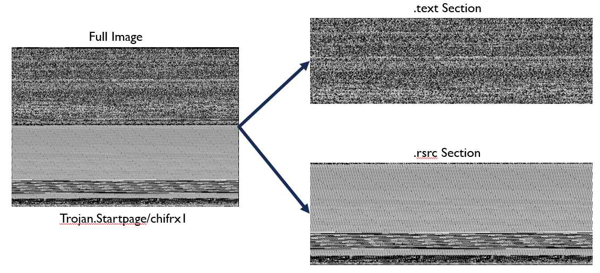
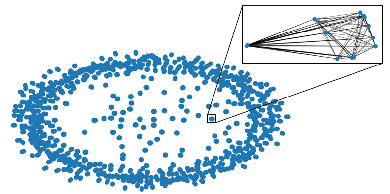
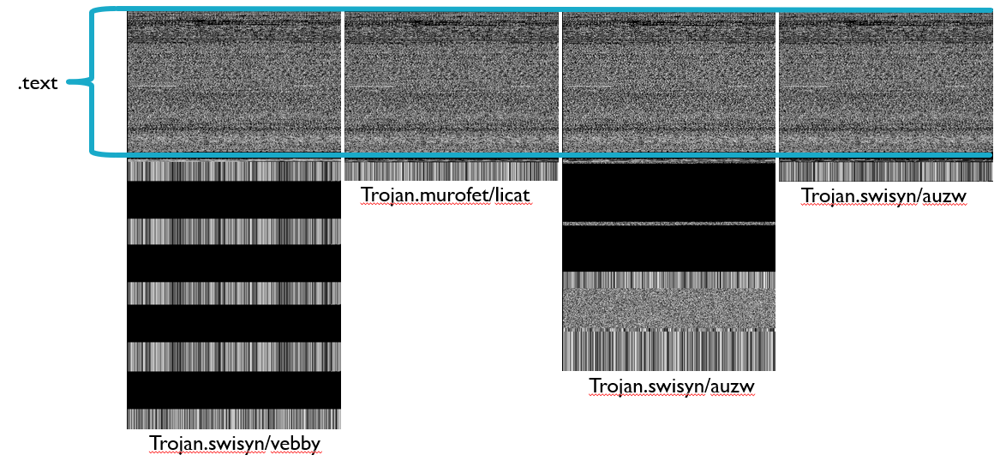
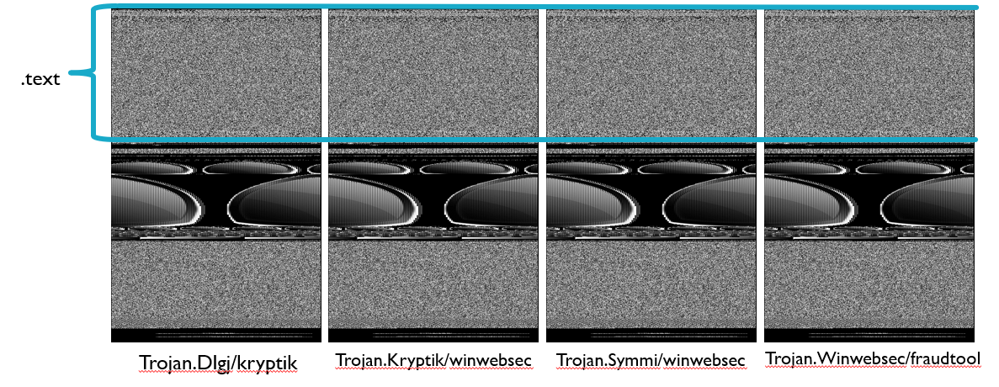
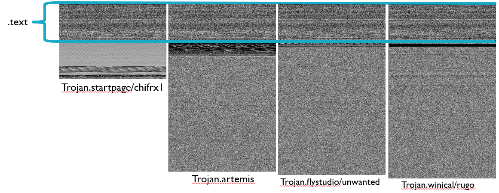

# Image-Based Malware Analysis
A folder containing the relevant scripts and descriptions for the Image-Based analysis portion of the project

## Background  
Because of the various forms of malware, as well as the sophisticated techniques that malware authors use to mask or spoof malware, malware recognition techniques require creative representations of the malware. One such representation is to transpose a byte-by-byte representation of a malicious file into a grayscale image, with the byte value of 0 being black and 255 white. This creates a standard image file, with the content of the image being black and white pixels. However, since malicious files may be filled with erroneous data, comparing exact images becomes problematic and distinctive features may be lost. By breaking the binary into its pre-defined segments and generating grayscale images for each section, we can isolate similar sections. Following, we can utilize existing machine learning algorithms to cluster based on the grayscale segments. This process reveals how malware segments have been re-used or spoofed.  

## Image Creation
To create the image, a python script is used to view a file byte-by-byte. Each of these bytes correspond to a grayscale pixel value, and are stored into an array of width 512 pixels. The width was chosen arbitrarily, as the width of 512 appeared visually fine for most files. Three things are accomplished during this image creation process:
1. The entire full file is saved as an image
2. Each individual binary segment is saved as an image
3. If the file contains icons, there are extracted and saved. This feature was copied from https://github.com/robomotic/pemeta

The image below shows the images created from Trojan.Startpage/chifrx1.

## Image Clustering
After the images have been created, another python script is utilized to create links between images. The script runs a simple pixel by pixel comparison included in the python pillow library. This function records and finds the average distance between all the pixels in the images. In the project a threshold of 2 was used, meaning that if the average difference was less then 2, the images were considered similar. For each similar picture, a line was drawn between them. Once all images were scanned and ran through the agorithm, the chart was plotted using networkx. Within this python library is a method to find all subgraphs, or clusters of images that are all related. These clusters were recorded and visually checked to confirm the algorithm results.    

The image below shows the resulting cluster graph when the text sections are compared using this process. Each blue dot is a collection of 2 or more connected nodes.

## Results
A collection of 6645 unique, labeled samples were used to form the results. From these samples 608 clusters were formed. While most clusters were the same family or same malware classifications, there were a handful of clusters showing unique characteristics. Below are 3 such clusters. Within these clusters, the .text sections are identical or near identical, meaning that the code used in the program matches between all of them. This demonstrates that there is similarity between these programs. However, when viewing the VirusTotal classifications for these samples, it was found that they are very different, sometimes not even in the same family. Further, the samples in cluster 259 are near identical in the entirety, with various small difference, and yet the classifications from VirusTotal are vastly different. The reasoning for this is unknown and requires further study into how malware is classified and the relationship between these files. 

These results are interesting as it shows that it is possible to compare malware based on their segments and that potentially different malware may be reusing the same code. This demonstrates that a certain cluster can be represented by a single image, which represents a fingerprint for that class of malware. By using a single image fingerprint per cluster we can speed up malware detection techniques.

### Cluster #10:

### Cluster #259:

### Cluster# #435:

## SectionedImage.py

## ClusterImages.py
