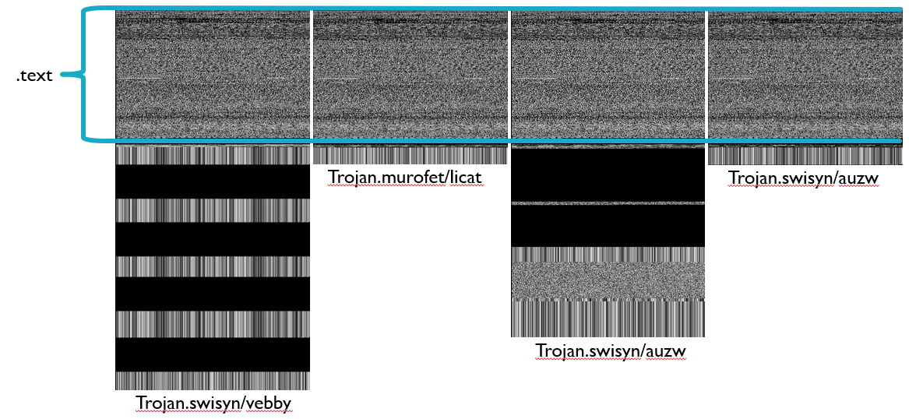

# Results
This folder contains the results from ClusterImages.py on a labled sample of 6645 unique PE Executables.   

The following list is of all sections and counts that were found within the sample used. Of the ones that were created, only the text cluster was analyzed further.  

- [x] full   - 6830
- [x] text   - 4997
- [x] icons  - 1446
- [x] rsrc   - 784
- [x] data   - 605
- [x] tqx    - 555
- [x] rcnwn  - 555
- [x] UPX1   - 345
- [ ] rdata  - 183
- [ ] reloc  - 131
- [ ] idata  - 122
- [x] CODE   - 107
- [x] UPX0   - 91
- [ ] aspack - 55
- [ ] bosevl - 51
- [ ] DATA   - 49
- [ ] itext  - 44
- [ ] tdata  - 35

## Text Section Results
Important Files: 
1. HashesAndClassif.txt - text file containing MD5 SHA256 Packing Classification from VirusTotal. Of the 7900 entries, only 6645 were properly formated and scanned.  

The 4997 samples that had a text section formed 608 clusters of at least 2 elements. While most clusters were the same family or same malware classifications, there were a handful of clusters showing unique characteristics. Below are 3 such clusters. Within these clusters, the .text sections are identical or near identical, meaning that the code used in the program matches between all of them. This demonstrates that there is similarity between these programs. However, when viewing the VirusTotal classifications for these samples, it was found that they are very different, sometimes not even in the same family. Further, the samples in cluster 259 are near identical in the entirety, with various small difference, and yet the classifications from VirusTotal are vastly different. The reasoning for this is unknown and requires further study into how malware is classified and the relationship between these files. 

These results are interesting as it shows that it is possible to compare malware based on their segments and that potentially different malware may be reusing the same code. This demonstrates that a certain cluster can be represented by a single image, which represents a fingerprint for that class of malware. By using a single image fingerprint per cluster we can speed up malware detection techniques.

### Cluster #10:

### Cluster #259:

### Cluster# #435:

