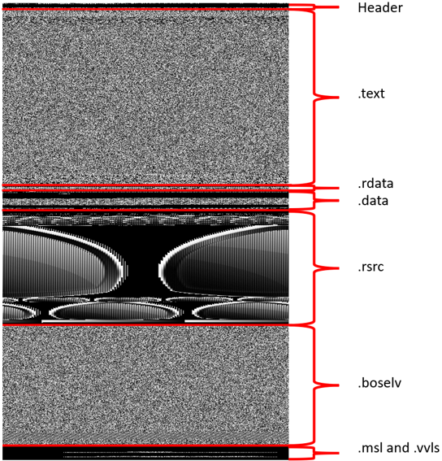

# Image-Based Malware Analysis
This is a folder containing the relevant scripts and descriptions for the Image-Based analysis portion of the project.

## Background  


Because of the various forms of malware, as well as the sophisticated techniques that malware authors use to mask or spoof malware, malware recognition techniques require creative representations of the malware. One such representation is to transpose a byte-by-byte representation of a malicious file into a grayscale image, with the byte value of 0 being black and 255 white. This creates a standard image file, with the content of the image being black and white pixels. However, since malicious files may be filled with erroneous data, comparing exact images becomes problematic and distinctive features may be lost. By breaking the binary into its pre-defined segments and generating grayscale images for each section, we can isolate similar sections. Following, we can utilize existing machine learning algorithms to cluster based on the grayscale segments. This process reveals how malware segments have been re-used or spoofed.  

Understanding the structure of a Windows PE file is an important concept related to the process of image. To learn more about this structure see [tech-zealots](https://tech-zealots.com/malware-analysis/pe-portable-executable-structure-malware-analysis-part-2/). The picture to the right shows the labeled sections on a sample created in the image creation process. This project looks at the .text segment of PE files as it was the most commonly seen segment in all the samples. There is some data collection for other segments, but those are unanalyzed. To view the .text segment results and other raw data see the [results](Results/) folder in this directory.  

<br clear="right"/>

## Image Creation
To create the image, SectionedImage.py is used to view a file byte-by-byte. Each of these bytes correspond to a grayscale pixel value, and are stored into an array of width 512 pixels. The width was chosen arbitrarily, as the width of 512 appeared visually fine for most files. Three things are accomplished during this image creation process:
1. The entire full file is saved as an image
2. Each individual binary segment is saved as an image
3. If the file contains icons, there are extracted and saved.

The image below shows the images created from Trojan.Startpage/chifrx1.


## Image Clustering
After the images have been created, ClusterImages.py is utilized to create links between images. The script runs a simple pixel by pixel comparison included in the python pillow library. This function records and finds the average distance between all the pixels in the images. In the project a threshold of 2 was used, meaning that if the average difference was less then 2, the images were considered similar. For each similar picture, a line was drawn between them. Once all images were scanned and ran through the agorithm, the chart was plotted using networkx. Within this python library is a method to find all subgraphs, or clusters of images that are all related. These clusters were recorded and visually checked to confirm the algorithm results.    

The image below shows the resulting cluster graph when the text sections are compared using this process. Each blue dot is a collection of 2 or more connected nodes.
<p align="center"></p>

## SectionedImage.py
This program is writen to create images from exe files. The program will keep executing but throw an error is the program is not a valid Windows PE Executable file.  
Requirements:  
1. Python3.8 or newer
2. Python libraries: imagehash, pefile, and pillow
3. (Optional) pev pepack - used to check for packer information
4. extracticon.py - used to extract icons. Slightly modified version taken from from https://github.com/robomotic/pemeta

This script is used to create images from files. There are three modes that the script can be run in:
1. Specify a singe file to parse:  
Usage - python3 SectionedImage.py -f file.exe  
2. Specify a directory to recursively scan:  
Usage - python3 SectionedImage.py -d ~/exedirectory  
3. Specify a path to a list containing file paths  
Usage - python3 SectionedImage.py -l filelist.txt

Other options that can be used wihin the program are:  
-o: Specify the out directory to save everything in. The default is ./imgs  
-w: Specify the width to save the images as. The default is 512  
-mi: Specify the minimum height that the image needs to be inorder to be saved. This removes sections that are too small. The default is 3  
-ma: Specify the maximum number of files to process. This is used if you want a specified count, say 1000, from a large folder. By default there is no maximum    

The output of this program is a directory containing:
1. A folder for each processed sample. Each folder has full.png, all sections saved as pngs, and an icos folder that has extracted icos saved as b0, b1, ...
2. A file called details.txt that stores details about all successful creations as json objects. Each image is stored with an array that is [size, averagehash, wavehash, perceptual hash, difference hash]. Example:  
```
{  
  "name": "test.exe",  
  "packer": "no packer found", 
  "sections": {  
    "text": [176128, "0000ffffdfffffcc", "0000ffffc7ff0d00", "9010593d759e76ba", "9cd8ad8c9e485518"],  
    "rsrc": [11776, "010000000fffff80", "c3880010bfffffc0",      "bf0ff3a2238448ab", "5f5232266bb02b0b"]  
  },  
  "full": [211951, "0000ffffffff0033", "00007fffecbd0077", "947925792578867b", "9cd8ac8e185514c6"],  
  "ico": [2204, "7e12040a160e7e3c", "7e1a360a166e7e38", "95a5cab0cdc35b86", "d8b66cd2a4dad471"]  
}  
```
3. A file called res.txt that stores the command line output that is being ran. Example:  
```
Processing /home/malware/test.exe   
Done  

Processing /home/malware/test2.exe  
'Data length less than expected header length.'  
```
4. A file called report.txt that stores information about errors, successes, icons, packers, etc. Example:
```
Errors:  
    162 - Header Length Issue  
     97 - Invalid start byte  
     80 - Unknown File Extension
     45 - Invalid NT Header
     36 - Invalid e_lfanew
     27 - Embedded null byte
     21 - NoneType cant save
      
Total In: 7900
Total Success: 6645
Total Errors: 1255

Section Counts:
    261 - 0 Sections
   4552 - 1 Sections
   1379 - 2 Sections
    225 - 3 Sections
    138 - 4 Sections
     59 - 5 Sections

With Icons: 1443
Without Icons: 6457

Packed: 2156
Not Packed: 5744
```

## ClusterImages.py
This program is writen to cluster the images created by SectionedImage.py.  
Requirements:  
1. Python3.8 or newer
2. Python libraries: numpy, networkx, and pillow

This script is used to create images from files. There are various modes that the script can be run in:   
1. Cluster on icons  
Usage - python3 ClusterImages.py -d dir -c hashes.txt  
2. Cluster on a specified section  
Usage - python3 ClusterImages.py -d dir -c hashes.txt -n text.png  
3. Rebuild/resave clusters from pickled icon list  
Usage - python3 ClusterImages.py -d dir -c hashes.txt -li icolist.pkl  
4. Rebuild/resave clusters from pickled section list  
Usage - python3 ClusterImages.py -d dir -c hashes.txt -ls textlit.pkl -n text.png  

Options:  
(Required) -c: A classification file that contains MD5 SHA256 Packers Classification separated by tab  
(Required) -d: The directory created by SectionedImage.py  
-o: The directory to save the clusters to. The default is ./clusters  
-t: The threshold to say that images are similar. The default is 2  

The output of the script is a directory that contains:  
1. A folder of for each cluster that has all the related images labeled by file name
2. A list of clusters, their members and counts. Example:  
```
Cluster 596: 
trojan_farfli/graftor - 1
trojan_farfli/rootkit - 1
trojan_rootkit/farfli - 1

Cluster 597: 
trojan_farfli/rootkit - 3
```
3. A list.pkl file that is all the clusters in list form saved with pickle
4. A graph.pkl file that is the networkx graph saved with pickle
