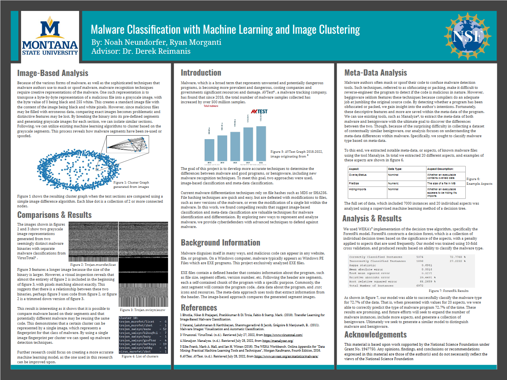

# binary-fingerprint
A repository for the binary-fingerprinting project of the 2022 MSU REU program.  

Below is the breakdown of the folder structure for this repository.  
1. BackgroundInformation - Contains information about useful general information, packers, common dlls, and general knowledge related to this project.
2. MalwareImageAnalysis - The part of the project that created image representations for malware. Within this folder is a breakdown of all related scripts, the goal, and results. See this folder's readme for more information.
3. Pictures - A folder of pictures that are used in the readme files.
4. TestScripts - A folder containing various python scripts that were created for the project. These scripts either were never completed or yielded results that were not relevant to the final project. All scripts in this folder are in various states of completeness and are included only for documentation purposes.
5. Tools - A folder containing various python scripts that were used and helpful to the final state of the program. This folder's readme provides a general overview of each script and their usage.  

## Poster

## Acknowledgements
This material is based upon work supported by the National Science Foundation under Grant No. 1947750. Any opinions, findings, and conclusions or recommendations expressed in this material are those of the author(s) and do not necessarily reflect the views of the National Science Foundation.  

Created by: Noah Neundorfer & Ryan Morganti  
Advisor: Dr. Derek Reimanis
